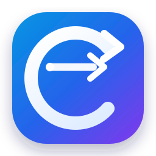
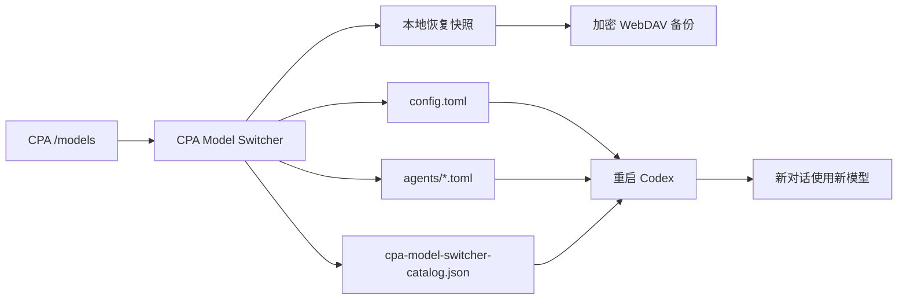

<p align="center">
  
</p>

<h1 align="center">CPA Model Switcher</h1>

<p align="center">
  面向 Codex Desktop 的独立 Windows 模型与子代理配置工具
</p>

<p align="center">
  <a href="https://github.com/beer-on-ice/cpa-model-switcher/releases/latest"></a>
  <a href="https://github.com/beer-on-ice/cpa-model-switcher/actions/workflows/release.yml"></a>
  
  <a href="LICENSE"></a>
</p>

<p align="center">
  <a href="https://github.com/beer-on-ice/cpa-model-switcher/releases/latest"><strong>下载最新 Windows 版本</strong></a>
  · <a href="README_EN.md">English</a>
  · <a href="#三步上手">快速上手</a>
  · <a href="#常见问题">常见问题</a>
</p>

> [!IMPORTANT]
> 这是一个独立桌面程序，不注入、不修改 Codex Desktop 程序文件。只有在你确认后，它才会写入 `%USERPROFILE%\.codex` 下的配置，并且每次写入前都会创建恢复快照。

## 一眼看懂

| 你想做什么 | CPA Model Switcher 会做什么 |
|---|---|
| 切换主代理模型 | 修改 `config.toml`，可选择保存后自动重启 Codex |
| 给不同子代理分配模型 | 扫描和管理 `agents/*.toml`，支持跟随主代理或独立模型 |
| 让 CPA 模型出现在 Codex 模型目录 | 根据 `/models` 动态生成 `cpa-model-switcher-catalog.json` |
| 管理多个 CPA | 保存多条线路，分别配置地址、API Key 和传输方式 |
| 排查 400、WebSocket、压缩问题 | 提供 HTTP、WebSocket 和 `/responses/compact` 单项诊断 |
| 防止改坏配置 | 写入前自动备份、哈希冲突检测、一键恢复 |
| 跨设备备份 | 使用 AES-256-GCM 加密后上传 WebDAV |

## 三步上手

### 1. 配置 CPA 线路

进入 **线路管理**，填写：

- 显示名称
- Codex provider 标识
- CPA `/v1` 地址
- API Key
- HTTP / WebSocket 模式

点击 **测试此线路**，确认能够读取模型列表。

### 2. 选择主代理和子代理模型

在 **模型切换** 页面：

- 选择主代理模型与推理强度；
- 为每个子代理选择“跟随主代理”或独立模型；
- 点击角色名称查看职责、适用场景、沙箱模式和配置文件；
- 需要时创建新的自定义角色。

### 3. 应用配置

| 按钮 | 行为 |
|---|---|
| **仅保存配置** | 写入并备份，不中断正在运行的 Codex；当前对话不会切换模型 |
| **应用并重启 Codex** | 写入、备份、关闭并重新启动 Codex；重启后新对话可靠读取新模型 |

> [!NOTE]
> 自定义 CPA provider 在 Codex 顶部可能仍被归类为“自定义”。真实模型以新会话的请求记录和 `turn_context.model` 为准。

## 工作流程



## 功能概览

### 主代理与模型目录

- 切换 `model_provider`、`model` 和 `model_reasoning_effort`。
- 从当前 CPA `/models` 获取完整模型列表。
- 动态生成：

```text
%USERPROFILE%\.codex\cpa-model-switcher-catalog.json
```

- 不覆盖、不删除其他工具维护的模型目录。
- 支持保存后自动定位并重启 Codex Desktop 主进程。

### 子代理矩阵

- 自动发现 `%USERPROFILE%\.codex\agents\*.toml`。
- 为每个角色单独设置模型和推理强度。
- 一键让全部角色跟随主代理。
- 可保护视觉与文档角色，避免批量切换。
- 点击角色名称查看中文用途和完整配置。
- 创建自定义角色并自动注册 `[agents.<role_id>]`。

### 多线路 CPA

- 保存多条 OpenAI Responses API 兼容线路。
- 为每条线路设置独立的 provider ID、地址、API Key 和传输模式。
- 自动导入 Codex 当前使用的 provider。
- API Key 的应用副本使用 Electron `safeStorage` 与 Windows 安全存储保护。

### 连接诊断

| 诊断项 | 用途 |
|---|---|
| HTTP `/models` | 检查地址、凭据、延迟和模型数量 |
| Responses WebSocket | 检查握手与长连接兼容性 |
| `/responses/compact` | 验证上下文压缩是否使用当前模型 |
| 运行日志 | 记录配置写入、模型目录生成和 Codex 重启阶段 |

运行日志位置：

```text
%APPDATA%\cpa-model-switcher\logs\app.log
```

### 备份与恢复

- 每次配置写入前创建时间戳快照。
- 保留主配置、角色配置和本工具模型目录。
- 恢复前再次创建安全快照。
- 使用 SHA-256 检测文件是否被其他程序修改。

### 加密 WebDAV

- 自动或手动上传 `.cpabackup`。
- 备份使用 AES-256-GCM 加密，不上传明文配置。
- 支持远程列表、下载、解密和恢复。
- WebDAV 密码与加密口令使用 Windows 安全存储保护。

## 默认管理的文件

```text
%USERPROFILE%\.codex\config.toml
%USERPROFILE%\.codex\agents\*.toml
%USERPROFILE%\.codex\cpa-model-switcher-catalog.json
```

应用自己的数据位于：

```text
%APPDATA%\cpa-model-switcher\
├── settings.json
├── backups\
└── logs\app.log
```

## 安全设计

- Renderer 无法直接访问 Node.js 或文件系统。
- 启用 Electron `contextIsolation`，关闭 Renderer Node 集成。
- API Key、WebDAV 密码和加密口令不会写入运行日志。
- 配置使用临时文件和原子替换写入。
- 写入前自动备份；恢复前再次备份。
- WebDAV 只接收加密归档。
- 不修改 Codex Desktop 安装目录。

> [!WARNING]
> “应用并重启 Codex”会中断正在运行的对话和子代理任务。请先等待重要任务结束。

## 系统要求

- Windows 10/11 x64
- 已安装 Codex Desktop
- 一个兼容 OpenAI Responses API 的 CPA 服务
- 可选：支持 Basic Auth 的 WebDAV 服务

## 本地开发

```powershell
npm install
npm test
npm run smoke
npm start
```

构建便携 EXE：

```powershell
npm run dist
```

产物位置：

```text
release/CPA-Model-Switcher-<version>-x64.exe
release/SHA256SUMS.txt
```

## 自动构建与发布

工作流：[`.github/workflows/release.yml`](.github/workflows/release.yml)

- 手动运行：生成 Windows x64 Actions 构建产物，不创建 Release。
- 推送 `v*.*.*` 标签：自动测试、构建、生成 SHA-256 并发布 GitHub Release。
- 标签版本必须与 `package.json` 一致。
- 使用仓库自带的 `GITHUB_TOKEN`，无需额外 Personal Access Token。

```powershell
npm version 0.6.0 --no-git-tag-version
git add package.json package-lock.json
git commit -m "chore: release v0.6.0"
git tag -a v0.6.0 -m "CPA Model Switcher v0.6.0"
git push origin main v0.6.0
```

## 测试范围

当前测试覆盖：

- TOML 定点修改、注释保留和冲突检测
- 主代理、provider、模型目录和子代理切换
- 自定义角色创建与注册
- Codex Desktop 主进程识别和模拟重启
- 本地快照与恢复
- AES-256-GCM 备份加密
- 模拟 WebDAV 上传、列表、下载和恢复
- Electron Renderer / Preload 冒烟检查

## 常见问题

<details>
<summary><strong>为什么 Codex 仍然显示“自定义”？</strong></summary>

自定义 provider 可能被 Codex 统一归类为“自定义”。本工具会同步具体模型名称，但真实生效模型仍应以新会话请求记录为准。

</details>

<details>
<summary><strong>切换模型后，当前对话会改变吗？</strong></summary>

不会。模型属于会话上下文的一部分。使用“应用并重启 Codex”，然后创建新对话。

</details>

<details>
<summary><strong>为什么 Windows SmartScreen 提示未知发布者？</strong></summary>

当前构建尚未配置 Authenticode 代码签名。请从 GitHub Release 下载并核对发布页面中的 SHA-256。

</details>

<details>
<summary><strong>WebDAV 失败会不会破坏本地配置？</strong></summary>

不会。WebDAV 上传发生在本地配置和快照成功保存之后；上传失败时，本地快照仍然保留。

</details>

## Logo

`assets/logo.svg` 由 CPA 中的 `gemini-3.8-flash-high` 根据项目功能重新设计，概念为“双轨路由矩阵”：两条代理/模型通道在中心网关交叉切换。设计未使用第三方商标或网络素材，最终 SVG 由项目侧审核并针对小尺寸显示进行了调整。

当前 Windows EXE 仍使用 Electron 默认程序图标。后续可以基于此 SVG 生成 ICO，并加入 Windows 程序签名与图标资源。

## License

[MIT License](LICENSE)
