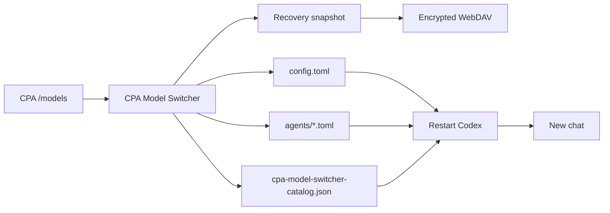

<p align="center">
  
</p>

<h1 align="center">CPA Model Switcher</h1>

<p align="center">An independent Windows control panel for Codex Desktop models and subagents</p>

<p align="center">
  <a href="https://github.com/beer-on-ice/cpa-model-switcher/releases/latest"></a>
  <a href="https://github.com/beer-on-ice/cpa-model-switcher/actions/workflows/release.yml"></a>
  
  <a href="LICENSE"></a>
</p>

<p align="center">
  <a href="https://github.com/beer-on-ice/cpa-model-switcher/releases/latest"><strong>Download the latest Windows release</strong></a>
  · <a href="README.md">简体中文</a>
  · <a href="#three-step-setup">Quick start</a>
  · <a href="#faq">FAQ</a>
</p>

> [!IMPORTANT]
> This is a standalone application. It does not inject code into Codex Desktop or modify the Codex installation. At startup, the app syncs its own model catalog from the active CPA `/models` endpoint. This can update `%USERPROFILE%\.codex\config.toml` and the catalog JSON without a snapshot. Manually saving configuration or per-model settings creates a recovery snapshot first.

## At a glance

| What you want | What the application does |
|---|---|
| Switch the main-agent model | Updates `config.toml` and can restart Codex automatically |
| Toggle Fast mode | Sets `service_tier = "fast"` and `[features].fast_mode`; actual speed depends on the model and CPA |
| Assign models to subagents | Discovers `agents/*.toml` and supports follow-main or independent models |
| Choose WebSocket/HTTP per subagent | Creates a role-specific provider with the same CPA endpoint; roles may follow the base profile instead |
| Make CPA models visible | Syncs `cpa-model-switcher-catalog.json` from `/models` at startup and on refresh |
| Customize each model | Edit display name, context window, maximum window, and effective percentage in **Model Settings** |
| Manage multiple CPA endpoints | Stores endpoints, API keys, provider IDs, and transports |
| Diagnose failures | Tests HTTP, WebSocket, and `/responses/compact` |
| Recover safely | Creates snapshots, detects hash conflicts, and restores files |
| Back up off-device | Encrypts snapshots with AES-256-GCM before WebDAV upload |

## Three-step setup

### 1. Configure a CPA profile

Open **Provider Profiles**, enter the provider ID, `/v1` endpoint, API key, and transport mode, then select **Test this profile**.

### 2. Assign models

Open **Model Switcher** to choose the main model and reasoning effort. Each subagent can follow the main agent or use an independent model. Click a role to inspect its responsibility, sandbox, and configuration file.

Fast mode is a service-tier preference, not a guaranteed speed boost. A CPA provider may reject, ignore, or bill it differently. The subagent connection selector offers **Follow profile**, **WebSocket**, and **HTTP streaming**. An independent choice uses a dedicated provider ID with copied endpoint/auth and a different `supports_websockets` value; it does not prove a successful WebSocket handshake.

### 3. Apply the configuration

| Action | Behavior |
|---|---|
| **Save configuration only** | Writes and backs up files without interrupting Codex; the current chat keeps its model |
| **Apply and restart Codex** | Writes, backs up, closes, and relaunches Codex; new chats read the new model |

> [!NOTE]
> Codex may still group a custom CPA provider under “Custom.” The authoritative value is the new session request and its `turn_context.model` field.

## How it works



## Feature map

### Models and subagents

- Change `model_provider`, `model`, and `model_reasoning_effort`.
- Fetch the active CPA model list on startup and refresh, and generate `%USERPROFILE%\.codex\cpa-model-switcher-catalog.json`. If CPA is offline, keep the existing catalog.
- Preserve catalogs maintained by other tools.
- **Model Settings** edits `display_name`, `context_window`, `max_context_window`, and `effective_context_window_percent` per model ID. Refresh preserves exact-model customizations; new IDs do not inherit another model's edited window.
- These are local Codex catalog metadata, not a way to increase the provider's actual limit. An excessive value can cause request failures. Restart Codex and start a new chat after editing. Manual per-model saves are snapshotted; automatic sync is not.
- Toggle Fast mode by updating both `service_tier` and `[features].fast_mode` for new turns. Subagents may inherit the global tier unless their role file overrides it.
- Discover and manage `%USERPROFILE%\.codex\agents\*.toml`.
- Assign independent models, follow the main agent, protect specialist roles, and create custom roles.
- Select an independent WebSocket or HTTP transport for a role while leaving the main provider unchanged.

### Profiles and diagnostics

- Store multiple Responses API-compatible CPA profiles.
- Protect saved API-key copies with Electron `safeStorage`.
- Test `/models`, Responses WebSocket, and `/responses/compact`.
- Record configuration and restart stages in:

```text
%APPDATA%\cpa-model-switcher\logs\app.log
```

### Recovery and WebDAV

- Snapshot manual main/subagent and per-model saves, and create a safety snapshot before restore. Startup catalog sync is not snapshotted.
- Detect external changes with SHA-256 hashes.
- Encrypt `.cpabackup` archives with AES-256-GCM.
- List, download, decrypt, and restore remote WebDAV backups.

## Managed files

```text
%USERPROFILE%\.codex\config.toml
%USERPROFILE%\.codex\agents\*.toml
%USERPROFILE%\.codex\cpa-model-switcher-catalog.json
```

Application data:

```text
%APPDATA%\cpa-model-switcher\
├── settings.json
├── backups\
└── logs\app.log
```

## Security design

- The Renderer has no direct Node.js or filesystem access.
- Electron `contextIsolation` is enabled and Renderer Node integration is disabled.
- Secrets are excluded from runtime logs.
- Configuration files use temporary files and atomic replacement.
- Manual configuration and per-model saves are snapshotted before writing; restore also creates a safety snapshot. Startup catalog sync is not snapshotted.
- WebDAV receives encrypted archives only.
- The Codex Desktop installation directory is never modified.

> [!WARNING]
> **Apply and restart Codex** interrupts active chats and subagent tasks. Wait for important work to finish first.

## Requirements

- Windows 10/11 x64
- Codex Desktop installed
- A CPA service compatible with the OpenAI Responses API
- Optional: a WebDAV service with Basic Auth

## Local development

```powershell
npm install
npm test
npm run smoke
npm start
```

Build the portable executable:

```powershell
npm run dist
```

Output:

```text
release/CPA-Model-Switcher-<version>-x64.exe
release/SHA256SUMS.txt
```

## Automated builds and releases

Workflow: [`.github/workflows/release.yml`](.github/workflows/release.yml)

- Manual dispatch creates a Windows x64 artifact without publishing a Release.
- A `v*.*.*` tag tests, builds, generates SHA-256, and publishes a GitHub Release.
- The tag must match the version in `package.json`.
- The workflow uses the repository `GITHUB_TOKEN`; no Personal Access Token is required.

```powershell
npm version 0.7.0 --no-git-tag-version
git add package.json package-lock.json
git commit -m "chore: release v0.7.0"
git tag -a v0.7.0 -m "CPA Model Switcher v0.7.0"
git push origin main v0.7.0
```

## Test coverage

- Targeted TOML updates, comment preservation, and conflict detection
- Main-agent, provider, model-catalog, and subagent switching
- Custom-role creation and registration
- Codex Desktop process identification and mocked restart behavior
- Local snapshots and restoration
- AES-256-GCM backup encryption
- Mock WebDAV upload, listing, download, and recovery
- Electron Renderer / Preload smoke checks

## FAQ

<details>
<summary><strong>Why does Codex still show “Custom”?</strong></summary>

Codex may group a custom provider under “Custom.” The application synchronizes concrete model names, but the real model should still be verified from the new session request.

</details>

<details>
<summary><strong>Does switching models change the current chat?</strong></summary>

No. The model is part of the chat context. Use **Apply and restart Codex**, then create a new chat.

</details>

<details>
<summary><strong>Why does Windows SmartScreen show an unknown publisher?</strong></summary>

The executable is not Authenticode-signed. Download it from GitHub Releases and verify the published SHA-256 checksum.

</details>

<details>
<summary><strong>Can a failed WebDAV upload damage the local configuration?</strong></summary>

No. WebDAV upload occurs after local configuration and snapshot storage. The local snapshot remains available after an upload failure.

</details>

## Logo

`assets/logo.svg` was redesigned by `gemini-3.8-flash-high` through the configured CPA. The concept is a dual-track routing matrix: two agent/model channels cross at a central gateway. It uses no third-party trademark or downloaded artwork, and the final SVG was reviewed and adjusted for small icon sizes.

The Windows executable still uses the default Electron program icon. The SVG can later be converted into an ICO asset alongside Windows code signing.

## License

[MIT License](LICENSE)
